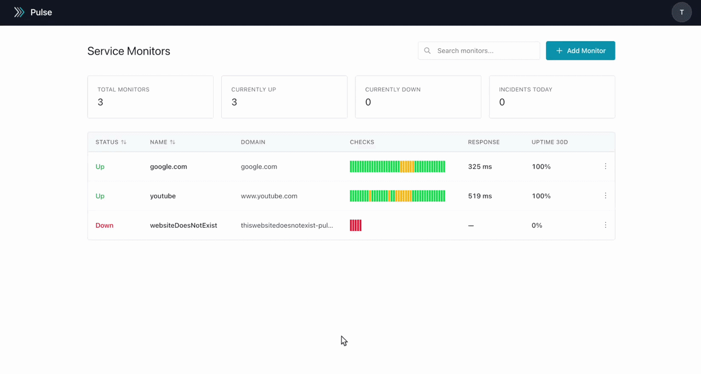
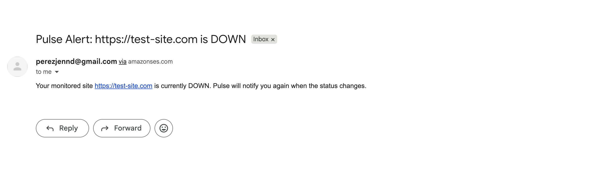
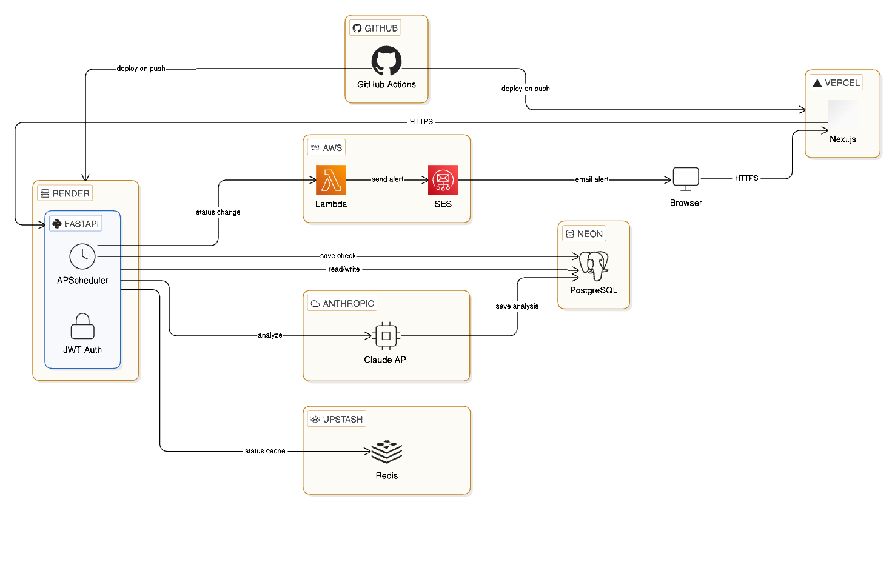

# Pulse — Uptime Monitor

Monitors websites, detects slow responses before full outages, and uses the Claude API to summarize reliability trends.

[Live site](https://pulse-three-phi.vercel.app) · [Demo video](https://drive.google.com/file/d/1k-_8m6bBccmcOtgmtSQAz09RIG_4j2pp/view?usp=sharing)

> ⚠️ Backend runs on Render's free tier — first request may take ~30 seconds to wake from sleep.

<details>
<summary>Table of Contents</summary>

- [How it works](#how-it-works)
- [Architecture](#architecture)
- [Stack](#stack)
- [Features](#features)
- [Local development](#local-development)
- [Tests](#tests)

</details>

---



**Alert email when a monitor goes DOWN:**



## How it works

Add a URL to monitor. A background worker pings it on a schedule and sends one email when a site goes down. If the site recovers and goes down again, a new alert fires.

- Site goes DOWN → Lambda fires → SES sends email → incident logged
- Response time spikes past 3 standard deviations → flagged as SLOW
- Click Analyze → Claude compares that monitor against your others → summary saved

## Architecture



## Stack

| Layer | Technology |
|---|---|
| Frontend | Next.js + TypeScript + Tailwind CSS |
| Backend | FastAPI (Python 3.13) |
| Background worker | APScheduler |
| Database | PostgreSQL via Neon |
| Cache | Redis via Upstash |
| Auth | PyJWT + refresh token rotation |
| Alerts | AWS Lambda + SES |
| AI | Claude API |
| CI/CD | GitHub Actions |
| Deployment | Render + Vercel |

## Features

**Monitoring** — UP / DOWN / SLOW status, response time chart (day / week / month), 30-day uptime %, incident history with duration

**Anomaly detection** — flags SLOW when a response takes significantly longer than the site's recent average. Requires 5 checks before flagging to avoid false positives on new monitors.

**Alerts** — one email per incident. A new alert only fires after the site recovers and goes down again. Uses AWS Lambda + SES.

**AI analysis** — sends 7 days of check data + data from your other monitors to the Claude API. Returns a plain-English summary. Rate limited to once per monitor per hour. History saved to PostgreSQL.

**Auth** — JWT with 30-min expiry, refresh token rotation, login rate limited to 5 attempts/min per IP.

## Local development

### Option A — Docker

```bash
git clone https://github.com/Jenn771/pulse
cd pulse
cp backend/.env.example backend/.env
docker compose up --build
```

Frontend: http://localhost:3000 · Backend: http://localhost:8000/docs

### Option B — Manual

```bash
# Backend
cd backend
python3 -m venv .venv && source .venv/bin/activate
pip install -r requirements.txt
cp .env.example .env
alembic upgrade head
uvicorn app.main:app --reload

# Frontend
cd frontend
npm install
cp .env.local.example .env.local
npm run dev
```

### Environment variables

Fill in `backend/.env` using `backend/.env.example` as a template, and `frontend/.env.local` using `frontend/.env.local.example`.

## Tests

```bash
cd backend && pytest tests/ -v
```

15 tests covering auth, monitor CRUD, authorization, anomaly detection, Redis caching, and AI rate limiting. CI runs on every push with `pip-audit` for dependency scanning.